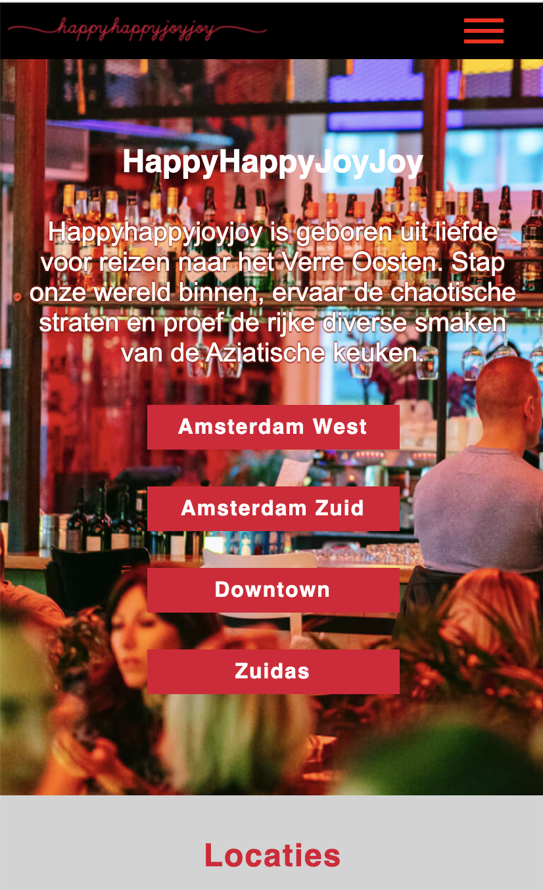
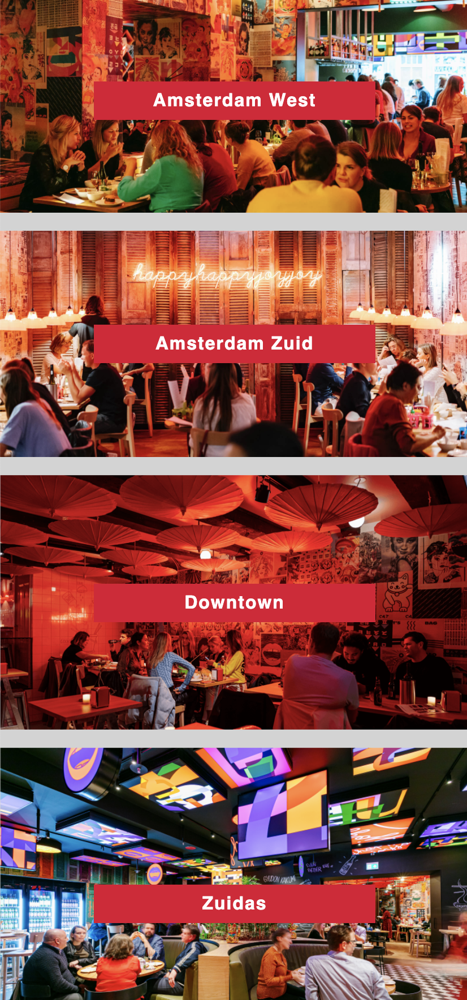
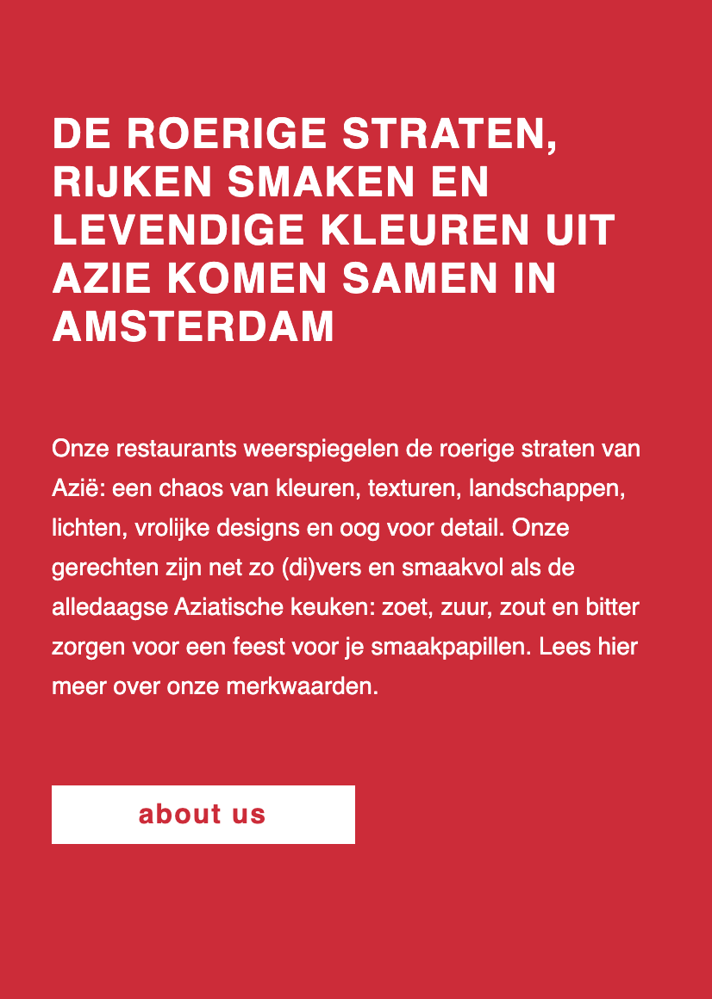
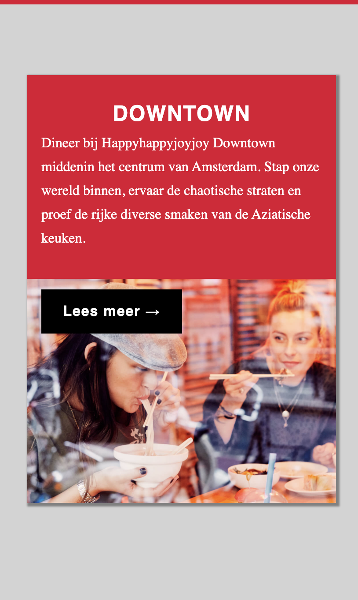
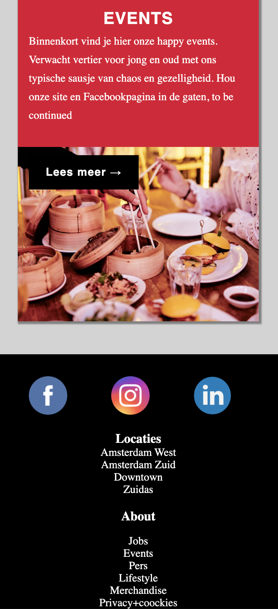
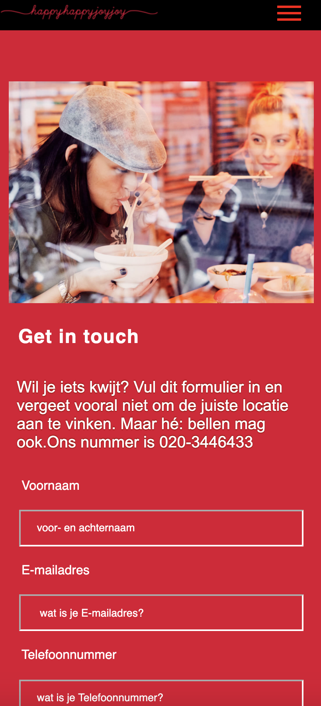
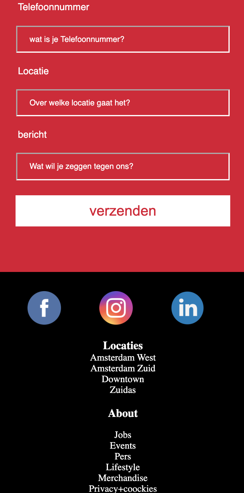
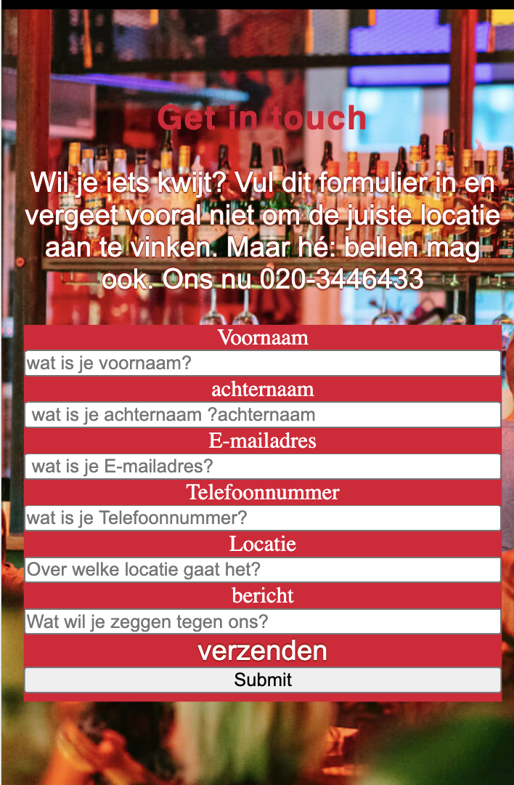
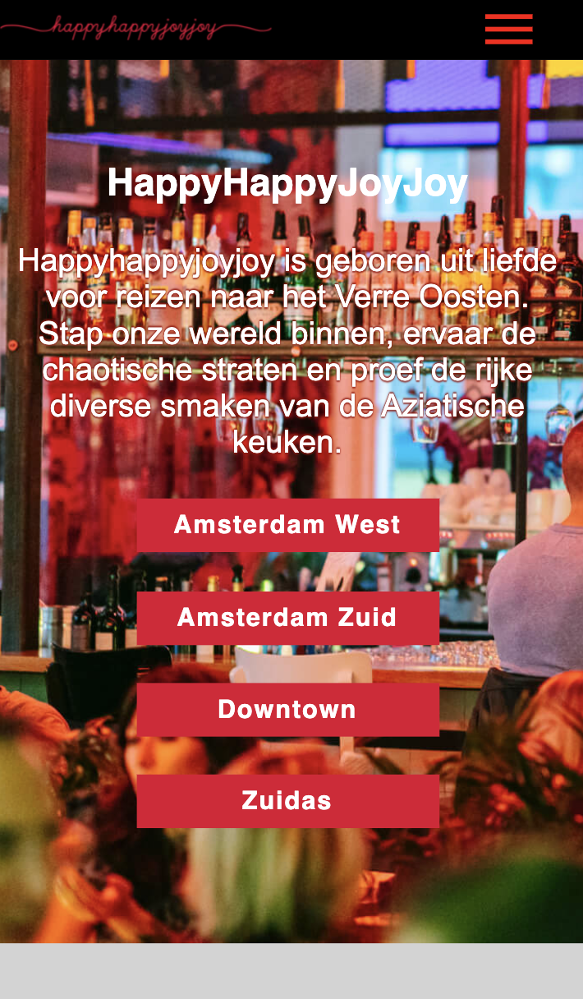
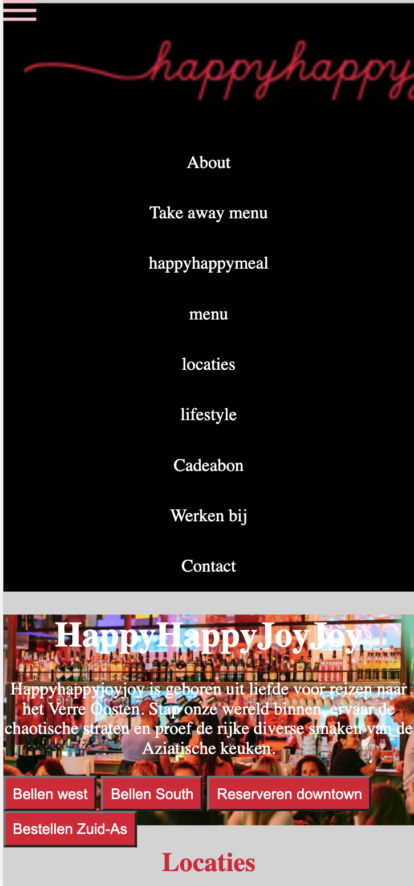

# Procesverslag
**Auteur:** - Merel -

Markdown cheat cheet: [Hulp bij het schrijven van Markdown](https://github.com/adam-p/markdown-here/wiki/Markdown-Cheatsheet). Nb. de standaardstructuur en de spartaanse opmaak zijn helemaal prima. Het gaat om de inhoud van je procesverslag. Besteedt de tijd voor pracht en praal aan je website.

## Bronnenlijst
1. Sanne
2. Marvin
3. Carolin
4. Facebook icoon - Wikipedia. (z.d.). Facebook icoon [foto]. Geraadpleegd van https://www.google.com/search?as_st=y&tbm=isch&hl=nl&as_q=facebook+icon+svg&as_epq=&as_oq=&as_eq=&cr=&as_sitesearch=&safe=images&tbs=ic:trans#imgrc=ru48MPqSIjBLfM
5. Instagram icoon - elharrakfonts. (z.d.). Instagram icoon [foto]. Geraadpleegd van https://www.google.com/search?q=instagram+icon+svg+&tbm=isch&ved=2ahUKEwjSiqSo04LuAhUDD-wKHb4iDbsQ2-cCegQIABAA&oq=instagram+icon+svg+&gs_lcp=CgNpbWcQAzIECAAQEzIECAAQEzIECAAQEzIICAAQBxAeEBMyCAgAEAcQHhATMggIABAHEB4QEzIICAAQBxAeEBMyCAgAEAcQHhATMggIABAHEB4QEzIICAAQBxAeEBM6BggAEAcQHjoICAAQCBAHEB5QjqISWLi8EmCpwBJoA3AAeACAAUCIAYYFkgECMTKYAQCgAQGqAQtnd3Mtd2l6LWltZw&sclient=img&ei=6zvzX5LpCYOesAe-xbTYCw&safe=images&tbs=ic%3Atrans&hl=nl#imgrc=j3x8nxunVP69uM
6. linked in icoon - Iconscout. (z.d.). Linked in icoon [foto]. Geraadpleegd van https://www.google.com/search?q=linkedin+icon+svg&tbm=isch&hl=nl&safe=images&tbs=ic:trans&sa=X&ved=2ahUKEwj986He1YLuAhUTLOwKHZ6GBpwQBXoECAEQLg&biw=1428&bih=840#imgrc=EunzbaJLNMJ2DM
7. een werkend telefoon nummer waaar op gedrukt kan worden bron -  Onak, G. O. A. G. (2020, 3 augustus). How to Create a Click to Call Link Using HTML and in WordPress. Geraadpleegd op 10 januari 2021, van https://www.gaintap.com/blog/clickable-website-phone-number-and-call-tracking-guide/
8. voor het maken van de animatie heb ik hulp gekregen van Sanne

## Eindgesprek (week 7/8)

-dit ging goed & dit was lastig-
Ik ben blij verrast met het product dat ik heb opgeleverd. Ik durf bijna te zeggen dat ik richting de Rode pieste kan gaan. Verder ben ik ook verbaasd op de kennis die ik nu beschik na het blok. Voordat ik hier aan begon had ik weinig tot geen zin in programmeren maar dit is positief verandert door de weken heen. Op een gegeven moment ging er een knop om en snapte ik het meer en vond ik het ook leuker om te doen (voornamelijk als iets lukte). Wat beter kon was minder vaak om hulp vragen wat ik op zich wel veel deed. Dit had te maken door soms het verband niet tussen de elementen te zien waardoor ik vast liep en om hielp vroeg. Mijn site was nooit zo ver gekomen zonder de hulp Sanne&Marvin en Caro. Telkens als ik vast liep, kon ik met mijn problemen bij hun terecht en zochten we het samen uit.

Wat ik voor de volgende keer anders wil doen:

Is eerder beginnen zodat ik meer extra dingen kon toevoegen aan mijn pagina's. Want ik heb nu namelijk het gevoel dat ik te weinig gedaan heb en er meer uit te halen viel. Ook had ik dan gekozen voor responsieve design in plaats van wat ik nu heb omdat ik daar meer aan had gehad voor later denk ik. Owja en meer verdiepen in Javascript omdat ik hier nog best wel vaak vragen over had en het had kunnen voorkomen als ik meer ermee geoefend had dan nu.

**Screenshot(s):**

-screenshot(s) van je eindresultaat-

Home pagina -

Ik ben heel erg verbaasd hoe goed de home pagina is geworden. Het is beter geworden dan ik ooit had verwacht aan het begin. Natuurlijk heb ik hier wel veel hulp bij gehad van Sanne, Caro en Marvin. Zonder hun hulp was mijn home pagina nooit zo goed geworden en wil ik hun hiervoor bedanken. Verder ben ik ook verbaasd hoe goed ik het begon op te pakken met coderen door de weken heen. In het begin had ik er amper tot geen vertrouwen in en dacht ik al dat ik een herkansing zou moeten doen omdat code niet mijn sterkste punt is. Maar door de weken heen en opdrachten begreep ik er steeds meer en lukte het mij toe te passen op de home pagina met hier en daar natuurlijk de nodige hulp om het nog beter en handiger te maken. Een groot punt waar ik heel trots op ben is de animatie die ik samen met Sanne heb gemaakt voor de in vliegende section als je scrolt.

Contact pagina -

Ik ben denk ik het trots op de contact pagina om een simpele rede.Dat is dat ik daar het meest zelf heb gedaan en dat had ik niet verwacht dat het ook zou lukken. Het is niet te vergelijke met de eerste pagina en dat begrijp ik. Maar toch ben ik er heel trots op ook al is het zo klein in vergelijking tot de andere en minder style elementen. Verder ben ik er ook achtergekomen hoeveel moeite het kost om een formulier te style op een manier dat je zelf wilt. Daar heeft de nodige frustratie in gezeten maar met een positief eindresultaat.

### Screenreader/VoiceOver verslag

home pagina 

Ik had eter kunnen opschrijven wat de h2 inhoudt want als ik er nu overheen gaat, zegt die h2 maar niet wat de inhoudt ervan is. Hierdoor maak ik het niet gebruikersvriendelijk voor iedereen en had ik hier beter op moeten letten. Verder leest hij de links ook niet goed voor totdat je ze aanklikt en dan vertelt hij wel wat er staat. Kortom heb ik daar zeker nog een paar verbeter punten wat ik in het vervolg moet meenemen als ik weer een site programmeer.

contact pagina 

Wederom heb ik hier weer hetzelfde met de h2 en p wat ik ook bij de home pagina had. Ik heb hiervoor er nog nooit zo erg naar gekeken of ik verdiept. Dus dit is zeker een verbeterd punt. Verder kwam ik er. wel achter dat mijn form toegankelijk is voor iedereen omdat die het veld netjes opleest en zegt wat je erin met schrijven. Dus komt het nog ergens op de site goed gelukkig.

## Voortgang 3 (week 6)

-same as voortgang 1-
Ik ben deze week deels al begonnen aan mijn ander pagina. Ik loop daar helaas wel weer vast met mijn section waar de achtergrond foto niet weg wilt. Terwijl ik her el een background-color geef maar die is alleen te zien als ik hem refresh en dan is die weer weg. Dus dat is zeker iets wat ik in de komende tijd moet gaan onderzoeken. Verder gaat het erg goed en maak ik grote stappen door alle geboden hulp die ik krijg van Sanne en Melvin. Verder bespreek ik soms ook mijn problemen met andere Studenten zoals  Carolin. Ook begin ik code steeds leuker te vinden eigenlijk beter dan verwacht. Tegenwoordig zit ik het liefst aan Fed en niet meer aan de andere vakken wat in het begin echt niet het geval was. ( verder biedt ik ook mijn excuses aan dat ik hem deze week niet voor 6 heb ingeleverd door omstandigheden thuis)

## Voortgang 2 (week 5)

Ik ben flink aan de slag gegaan met positief resultaat. Ik begin code leuker te vinden en besteed er meer tijd aan. Na het eerste feedback gesprek heb ik mijn code opgeruimd. Ik kan zelfs bijna beginnen aan mijn tweede pagina :).

## Voortgang 1 (week 3)

### Stand van zaken

Ik heb het zeker weer eens onderschat en spijt dat ik niet vanaf week 1 al was begonnen met mijn site. Ik snap de elementen los van elkaar maar er een geheel van maken vind ik heel lastig. Zoals een hamburger menu maken is een groot punt. Ik kan los het menu maken en de streepjes maar snap niet hoe ik er een geheel van moet maken.
-dit ging goed & dit was lastig-

**Screenshot(s):**

-screenshot(s) van hoe ver je bent met korte uitleg-

### Agenda voor meeting

-samen met je groepje opstellen-

week 1
|Bente     |Joep         | Merel    | Ian      |
| ---            | ---                | ---          | ---              |
| hoe plaats je  | hoe je een website           | hoe connect ik mijn twee elementen   | de layout    |
| een dorpdown icoon| simpel responsive maakt | voor het hamburger menu | dit wil ik zeker |positionering van plaatjes
| naast de summary         | ...                | waarom heb ik padding bij mijn achtergond en header        | dit weekend ga ik een start maken               |

week 2
|Bente     |Joep         | Merel    | Ian      |
| ---            | ---                | ---          | ---              |
| Ik wil graag hulp met js voor de 'slider'  | Niks          | Hoe ver moet mijn formulier werken?  | Ik wil graag wat hulp met m’n Java script    |
| Ik wil graag hulp bij de verkleuring van de achtergrond | - |  |
|         | ...                |         |                |

week 3
|Bente     |Joep         | Merel    | Ian      |
| ---            | ---                | ---          | ---              |
|  - |   -| waarom blijft mijn achtergrond afbeelding staan  | -  |
| -| - | - |
|    -    |        -       |      -  |        -       |

### Verslag van meeting

 feedback 1 - was een gesprek waar ik veel aan had en werdt geholpen met het samenstellen van mijn hamburger menu. verder kreeg ik te horen dat ik minder classes en id's moest gebruiken als het niet nodig was. Mijn doel voor het volgende gesprek is om minder tot geen classes en id's te gebruiken en verder mijn code uitbouwen.

feedback 2 - 
-na afloop snel uitkomsten vastleggen-
Ik kreeg vooral de feedbakc dat ik meer aan mijn procesboek moet werken en er meer content in moet zetten. Ik begrijp dit zelf ook omdat ik bijna geen aandacht aan mijn procesboek heb besteed en meer op mijn code. Ik heb flinke stappen gezet door de hulp van de andere. Verder is Sanne door mijn code heen gelopen om te kijken wat opgeschoonend kon worden. Hierdoor ben ik er achter gekomen dat ik vaak onnedige code in mijn css had staan wat simpeler en korter kon. 

feedback 3 - 
-na afloop snel uitkomsten vastleggen-
Wat voornamelijk naar voren kwam in het gesprek was at ik goed bezig was en redelijk op weg. Ik moest wel meer tijd besteden aan mijn procesboek.

## Breakdownschets (week 1)

-uitwerken voor de 1e werkgroep - eind van de eerste week-

## Intake (week 1)
-uitwerken voor de kick-off werkgroep - begin van de eerste week-

**Je startniveau:** -kies uit zwart, rood óf blauw-

Ik kies zeker weten voor de blauwe piesten omdat ik bijna nooit code schrijf of gebruik. Ik weet zeker dat ik aan dit vak het meeste tijd kwijt ben van dit blok.

**Je focus:** -kies uit responsive óf surface plane-

Mijn focus ligt op dit moment bij surface plane, stel dat ik hiermee niet verder kom wil ik later misschien veranderen van richting. Ben uiteindelijk voor surface plane gegaan omdat ik te weinig tijd had voor responsive.

**Je opdracht:** -link naar de website die je gaat namaken óf de naam van je eigen ontwerp-

Mijn gekoze site is happyhappyjoyjoy

- https://happyhappyjoyjoy.asia (homepagina)
- https://happyhappyjoyjoy.asia/contact/ (contactpagina)

**Screenshot(s) van de eerste pagina (small screen):**

**Screenshot(s) van de tweede pagina (small screen):**

